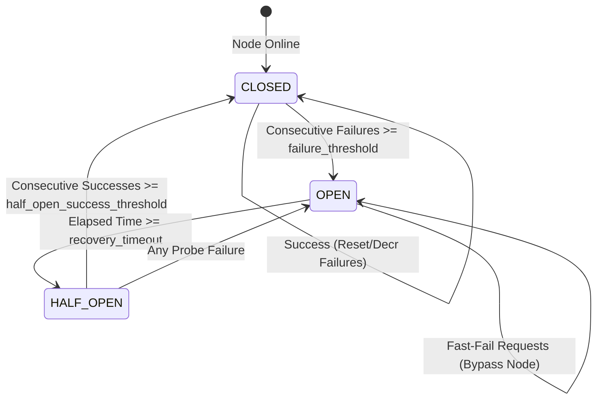
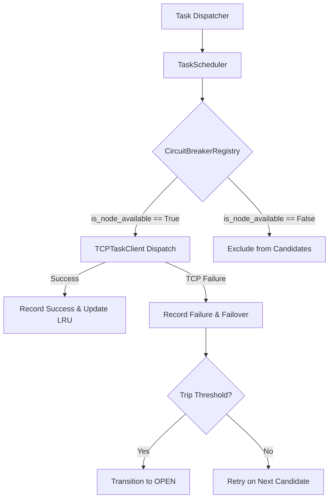

# MeshWeaver Circuit Breaker & Cluster Resilience Specification

## 1. Overview & Problem Statement
In decentralized compute meshes, worker nodes may suddenly crash, get partitioned, suffer resource exhaustion, or experience transient network faults. Without circuit breakers, client schedulers repeatedly attempt connections against unresponsive workers, incurring connection timeouts ($O(N \times \text{timeout})$ latency), saturating thread/socket pools, and triggering cascading cluster failures.

The **MeshWeaver Circuit Breaker Layer** (`meshweaver.circuit_breaker`) isolates failing or dead worker nodes, fast-failing dispatch requests without network delay, and automatically probes for worker recovery.

---

## 2. Circuit Breaker State Machine

### State Definitions:
1. **`CLOSED` (Normal Operation)**:
   - All scheduled tasks pass through to the target worker over TCP.
   - Successful dispatches decrement or reset the failure counter.
   - Consecutive communication failures increment `failure_count`.
   - When `failure_count >= failure_threshold`, state transitions to `OPEN`.

2. **`OPEN` (Fault Isolated)**:
   - The worker is marked unavailable and excluded from scheduling candidate pools (`scheduler.get_active_candidates()`).
   - Direct execution attempts immediately raise `CircuitBreakerOpenError` without waiting for network timeouts.
   - After `recovery_timeout` seconds elapse, the breaker automatically transitions to `HALF_OPEN`.

3. **`HALF_OPEN` (Recovery Probing)**:
   - Allows limited trial/probe requests (`probe_concurrency = 1`) to test whether the worker has restarted or recovered.
   - If a probe fails, the circuit immediately trips back to `OPEN`.
   - If `half_open_success_threshold` consecutive probes succeed, the circuit resets to `CLOSED`.

---

## 3. Configuration Parameters (`CircuitBreakerConfig`)

| Parameter | Default | Description |
| :--- | :--- | :--- |
| `failure_threshold` | `3` | Consecutive transport failures required to trip the circuit to `OPEN` |
| `recovery_timeout` | `5.0s` | Cooldown duration in `OPEN` state before permitting `HALF_OPEN` probe tasks |
| `half_open_success_threshold` | `2` | Successful probe requests required in `HALF_OPEN` state to return to `CLOSED` |
| `probe_concurrency` | `1` | Maximum concurrent trial requests permitted while in `HALF_OPEN` state |
| `backoff_multiplier` | `1.5` | Exponential multiplier scaling recovery timeout across repeated trips |
| `max_recovery_timeout` | `60.0s` | Maximum ceiling on dynamic recovery timeout |

### Dynamic Recovery Backoff Formula:
$$T_{\text{recovery}} = \min\left(T_{\text{max}}, T_{\text{base}} \times M^{\max(0, K_{\text{trips}} - 1)}\right)$$
Where $T_{\text{base}} = \text{recovery\_timeout}$, $M = \text{backoff\_multiplier}$, and $K_{\text{trips}}$ is the number of consecutive circuit trips.

### Composite Load Score Penalty Formula:
$$S = (w_{\text{cpu}} \times \text{CPU}\%) + (w_{\text{ram}} \times \text{RAM}\%) + (w_{\text{task}} \times N_{\text{in\_flight}}) + (w_{\text{fail}} \times N_{\text{failures}})$$
Where $w_{\text{fail}} = 15.0$ penalizes flaky nodes before a hard circuit trip occurs.

---

## 4. Error Discrimination & Exception Handling

MeshWeaver distinguishes between transport/network infrastructure failures and user-level computation exceptions:

- **Transport / Socket Failures (`ConnectionRefusedError`, `asyncio.TimeoutError`, TCP drops)**:
  - Recorded as worker operational failures in the circuit breaker.
  - Increment failure count and trigger automatic failover.
- **Application Exceptions (`RemoteExecutionError`)**:
  - Signifies that the remote worker node is healthy and responsive, but the submitted user Python callable raised an exception (e.g. `ZeroDivisionError`, `ValueError`).
  - Recorded as a node transport success; does not count against node liveness.

---

## 5. Architectural Integration

### Key Components:
- **`CircuitBreaker`**: Per-node state machine tracking failure counts, timestamps, and probe concurrency. Supports both synchronous `guard()` and asynchronous `async_guard()` context managers.
- **`CircuitBreakerRegistry`**: Centralized node breaker manager providing thread-safe and async-safe lookup, status queries, and tripping telemetry across all cluster peers.
- **`TaskScheduler` & `MeshNode`**: Native integration filtering eligible candidates and routing around degraded workers in real-time.
