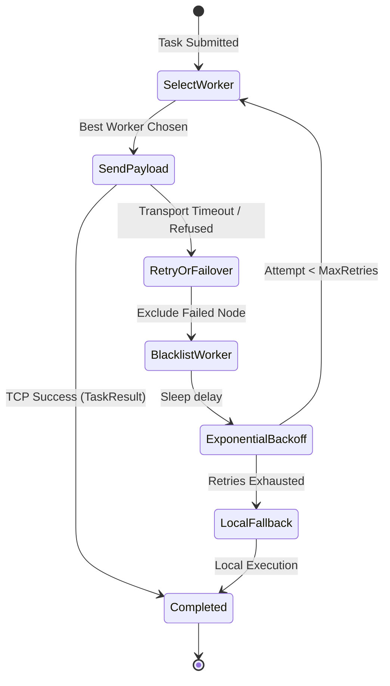

# MeshWeaver Scheduler & Distributed Compute Specification

## 1. Overview
The MeshWeaver Scheduler provides dynamic load-balancing, automated worker failover, distributed parallel MapReduce-style compute, and DHT-backed result memoization across decentralized mesh nodes.

---

## 2. Load Metric & Worker Scoring Model
Candidate worker scores are calculated using live telemetry disseminated via the Gossip protocol:

$$S = (w_{\text{cpu}} \times \text{CPU}\%) + (w_{\text{ram}} \times \text{RAM}\%) + (w_{\text{task}} \times N_{\text{in\_flight}})$$

### Default Weights:
- $w_{\text{cpu}} = 0.6$ (60% weight on CPU utilization)
- $w_{\text{ram}} = 0.4$ (40% weight on Memory utilization)
- $w_{\text{task}} = 5.0$ (Penalty score per active task currently assigned to the worker)
- **Overload Thresholds**: Nodes with $\text{CPU} \ge 90\%$ or $\text{RAM} \ge 95\%$ are flagged as overloaded.

---

## 3. Worker Selection Policies

1. **`LEAST_LOADED` (Default)**:
   - Selects the alive peer worker with the lowest composite score $S$.
2. **`ROUND_ROBIN`**:
   - Fair-share circular distribution across all healthy mesh peers.
3. **`POWER_OF_TWO_RANDOM`**:
   - Randomly samples 2 candidate peers and selects the one with the lowest score (mitigates thundering herd in large clusters).
4. **`LOCAL_FIRST`**:
   - Executes locally on the invoking node if remote workers are busy or unreachable.

---

## 4. Fault Tolerance & Automatic Failover

- **Retry Policy Parameters**:
  - `max_retries`: 3 attempts.
  - `backoff_factor`: 0.5s exponential backoff ($delay = backoff \times 2^{attempt - 1}$).
  - `timeout_per_attempt`: 5.0s per remote socket connection.
  - `exclude_failed_nodes`: Excludes unresponsive nodes during sub-sequent retry attempts.

---

## 5. Distributed Batch Map Engine (`mesh.map`)
- Divides inputs into configurable chunks.
- Asynchronously schedules subtasks across mesh nodes throttled by `asyncio.Semaphore(concurrency)`.
- Preserves input sequence ordering in final results.
- Provides `map_unordered()` async generator for stream processing.
- Collects `BatchMetrics` (total items, completed, failed, duration, throughput items/s).

---

## 6. DHT Result Memoization (`TaskCache`)
- Generates deterministic SHA-256 keys: `dht:task_cache:<sha256_hash>` based on function bytecode and arguments.
- Queries `DHTStorage.find_value()` prior to remote execution.
- Persists computed results in `DHTStorage.store()` with configurable TTL.
